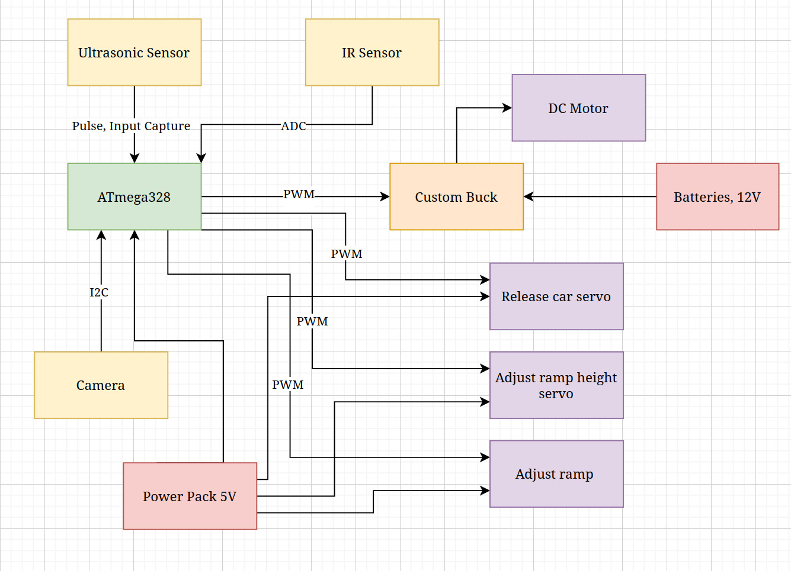

# final-project-skeleton

* Team Number: 15
* Team Name: 😱
* Team Members: Kevin Yao, Emil Schaumburg
* GitHub Repository URL: https://github.com/upenn-embedded/final-project-s25-0x0001f631
* GitHub Pages Website URL: [for final submission]

## Final Project Proposal

### 1. Abstract

*In a few sentences, describe your final project.*

Our final project will be a custom hot wheels booster/launcher that is programmed to detect and land a jump of variable distance. The microcontroller will use a camera and ultrasonic sensor to determine the distance and orientation of the jump, using servo motors to rotate the booster and angle the ramp. It will use a dc motor to spin rubber wheels which will accelerate the car off of the ramp at a calculated speed in order to land the jump.

### 2. Motivation

*What is the problem that you are trying to solve? Why is this project interesting? What is the intended purpose?*

Children around the world take up various common interests as they age. Many of these hobbies revolve around toys produced by mega-conglomerates, many of which pale in comparison to the fascinating world of Hot Wheels™. Kids dream of designing the coolest track, with tight twists and turns, loops, and most importantly, jumps. However, designing the perfect jump is an extraordinarily difficult task to do manually. One must have perfect aim, take into consideration the speed of the car as it becomes airborne, and control the angle of incidence as the wheels depart from the track. This is further limited by the speed of the Hot Wheels™ booster, which has no flexibility for adjustments. We begin the undertaking of our final project with the goal of constructing a booster which not only allows for adjustment of its speed, but will automatically adjust the aim of its track so that the Hot Wheels™ car will subsequently land the desired jump. This is interesting because it will entail fine-tuned motor control in order to land the jump, and requires appropriate input capture to determine where the desired endpoint of the jump is located.

### 3. System Block Diagram

*Show your high level design, as done in WS1 and WS2. What are the critical components in your system? How do they communicate (I2C?, interrupts, ADC, etc.)? What power regulation do you need?*

### 4. Design Sketches

*What will your project look like? Do you have any critical design features? Will you need any special manufacturing techniques to achieve your vision, like power tools, laser cutting, or 3D printing?*

The wheels and gears for the booster will be 3D printed, as well as the attachments for the servos. The mounts for the ramp and the base of the contraption, as well as the attachments for the camera, ultrasonic sensor, etc. will be laser cut.

### 5. Software Requirements Specification (SRS)

*Formulate key software requirements here. Think deeply on the design: What must your device do? How will you measure this during validation testing? Create 4 to 8 critical system requirements.*

*These must be testable! See the Final Project Manual Appendix for details. Refer to the table below; replace these examples with your own.*

**5.1 Definitions, Abbreviations**

Target - tape of a unique color attached to the end ramp that will be used to aim the on-ramp.

Vertical rotation servo - the servo attached to the on-ramp that angles it up and down.

Horizontal rotation servo - the servo mounted to the base that rotates the entire booster left and right.

**5.2 Functionality**

| ID     | Description                                                                                                                                                                     |
|--------|---------------------------------------------------------------------------------------------------------------------------------------------------------------------------------|
| SRS-01 | The microcontroller shall read from the OV7670 camera over I2C every 0.5 seconds.                                                                                               |
| SRS-02 | The microcontroller shall control the angles of the horizontal and vertical rotational servos in a feedback loop with the camera data.                                          |
| SRS-03 | The feedback loop in SRS-02 will exit when the target is in the correct position in the camera frame, at which point the microcontroller will send a trigger to the ultrasonic sensor. |
| SRS-04 | The microcontroller will have input capture on the echo pin of the ultrasonic sensor to measure distance to the target.                                                         |
| SRS-05 | ADC will be used to read from reflective IR sensor. When it reads below a threshold value, the microcontroller will actuate the servo that holds the car in place.                               |
| SRS-06 | The microcontroller will send a PWM signal, the duty cycle of which will control the speed of the DC motor based on a predetermined equation that takes as input how far the jump is. |

### 6. Hardware Requirements Specification (HRS)

*Formulate key hardware requirements here. Think deeply on the design: What must your device do? How will you measure this during validation testing? Create 4 to 8 critical system requirements.*

*These must be testable! See the Final Project Manual Appendix for details. Refer to the table below; replace these examples with your own.*

**6.1 Definitions, Abbreviations**

Custom buck converter: consists of a MOSFET, diode, inductor, and capacitor used to regulate the voltage driving the DC motor.

**6.2 Functionality**

| ID     | Description                                                                                                                        |
| ------ | ---------------------------------------------------------------------------------------------------------------------------------- |
| HRS-01 | A camera shall be used to find the target ramp. The resolution shall be 240x240 or higher.|
| HRS-02 | A IR sensor shall be used to determine if a car is ready to enter the launcher. It will inform the processor using an analog signal. |
| HRS-03 | A custom buck converter will step down 12V to a lower voltage given PWM from the processor. This stepped down output shall be used to power the motor. |
| HRS-04 | An ultrasonic sensor shall be used to find the distance to the target ramp. The range of the ultrasonic sensor should be at least 300cm (for reasonably rad jumps). |
| HRS-05 | A servo will be used to adjust the ramp height up and down. A similar servo will be used to hold the car in place, then rotate to allow the car into the launcher. |
| HRS-06 | A servo will be used to adjust the assembly left and right. |

### 7. Bill of Materials (BOM)

*What major components do you need and why? Try to be as specific as possible. Your Hardware & Software Requirements Specifications should inform your component choices.*

Camera - Used to find the target ramp, and used to provide feedback for steering the launcher ramp to aim at target.

Ultrasonic Sensor - Required to determine the distance the ramp is, which will determine speed of motor rotation.

IR Sensor - Used to determine when a car has been placed on the ramp, informing the system that it needs to turn on.

Motor - Used to generate speed for flywheel to launch car.

Servos - One to rotate ramp up/down, one to rotate assembly left/right. These two are for aiming at the ramp. One to keep the car in place/let it go into the launcher.

5V Power pack - Used to power servos and ATmega328PB.

12V 23A batteries - Used to provide power to the motor. 

Components for a buck converter (Transistor, inductor, capacitor) - Used to make buck converter. Ideally, these will be Detkin components. Not super on board with using a buck converter IC and soldering a dozen SMD parts...

*In addition to this written response, copy the Final Project BOM Google Sheet and fill it out with your critical components (think: processors, sensors, actuators). Include the link to your BOM in this section.*

https://docs.google.com/spreadsheets/d/1UzwNoVtzNW1yKDXhutoQyCoNw-ererVx3sm3JbrfIHA/edit?usp=sharing

### 8. Final Demo Goals

*How will you demonstrate your device on demo day? Will it be strapped to a person, mounted on a bicycle, require outdoor space? Think of any physical, temporal, and other constraints that could affect your planning.*

Device will be demonstrated on the floor, in some area, where we can set up the hotwheels ramps. The launcher will launch a car successfully onto the target ramp. We would need to set up somewhere less populated, in order to not impede foot traffic, or otherwise demo at a time when the building is less populated.

### 9. Sprint Planning

*You've got limited time to get this project done! How will you plan your sprint milestones? How will you distribute the work within your team? Review the schedule in the final project manual for exact dates.*

| Milestone  | Functionality Achieved | Distribution of Work |
| ---------- | ---------------------- | -------------------- |
| Sprint #1  |           (1) Buck convert for dc motor driver, (2) gears and base of launcher modeled and sent for printing, (3) camera communication, (4) servo ramp incline modeled and sent for printing             |  Kevin: 1, 3 Emil: 2, 4                    |
| Sprint #2  |           (1) Camera servo feedback, (2) Ultrasonic sensor motor feedback, (3) IR sensor for car             |          Emil: 1, Kevin: 2,3            |
| MVP Demo   |          (1) Mathematic model tweaking, (2) assembly integration            |          We will work together            |
| Final Demo |          (1) Enclosure for entire system to make it look nice, (2) More model tweaking, (3) Demo test case setup              |         Kevin: 2, 3 Emil : 1            |

**This is the end of the Project Proposal section. The remaining sections will be filled out based on the milestone schedule.**

## Sprint Review #1

### Last week's progress

Base machined, most parts arrived

Buck converter made, still need some tweaks, but stepping verified

Mounted IR sensor

Mounted servo

Power supply verified

Motor verified

### Current state of project

Assembly printed, some parts mounted, but most independently verified.

https://drive.google.com/file/d/1tKqQsuc8wZqvENJAGzmwVWnDV7s10e5J/view?usp=sharing

### Next week's plan

Reprint gears

Configure camera (Raspi + comm with ATmega) (Camera gotten did not work)

Tweak buck converter to ensure proper operation

Make sure buck does not fry ATmega (back voltage / ground shenanigans)

Get motor to spin gears

## Sprint Review #2

### Last week's progress

Turns out the buck converter was a waste of time; Switched to PWM as BJT gate for power modulation.

Got the motors on the launcher, they work!

Got ball bearings attached

Used ATmega to generate PWM signal to spin motors: car launched. 

Car acceleration confirmed.

Raspi has program that can find bounding box for given color. 

ATmega should be able to interface with the ultrasonic device.

Precise control of servos, interfacing with IR sensor works.

### Current state of project

https://drive.google.com/file/d/1GDbujAaHh5vkGAE1w357TcFrnMiB1Vt1/view?usp=sharing

### Next week's plan

Launch car using higher power (were using the Detkin power supply, which has low(er) limits (than the wall adapter we plan on using))

Get SPI working so we can send bounding box to ATmega.

Perfboard for all the motor powering stuff (and maybe all the sensors)

Integration of sensors.

## MVP Demo

1. Show a system block diagram & explain the hardware implementation.

https://docs.google.com/presentation/d/1GcbwykO9LemA98kKRiCxgUSrDAbUXj3kivS9V8kuuuM/edit?usp=sharing

Motors are powered by wall outlet supply, and the connection is controlled by a PWM signal from our ATmega. 5V from the power pack supplies power for all other peripherals. Raspi captures images and processes important information we need, then sends it to ATmega via SPI. ATmega adjusts the direction our launcher is facing and the launcher ramp angle, as well as controls when the car is released, using servos, which it controls by adjusting duty cycles of PWMs.

2. Explain your firmware implementation, including application logic and critical drivers you've written.'

The two code files are included in this repository, main.c and pi_code.cpp.

Our logic works as follows. Upon booting, the first thing that the code does is move the servos to their original positions using 50Hz PWM signals at the duty cycle which corresponds with the desired angle. Timer0 is used for all of the servo PWM signals, since only one servo needs to be moved at a given time (we simply toggle a different pin depending on the active servo). This is state 4, the reset state, which then moves onto state 0 (the beginning of the control loop).

The system starts in state 0, at which point the car has not yet been placed on the track. We read ADC values for the photoresistor to poll if the car is placed on the track, at which point we move to the next state. 

At state 1, we implement our written SPI slave logic on the ATMega to read detected ramp position data from the Raspberry Pi, which includes toggling a SPI interrupt. The code then interprets that data and uses custom logic to write the appropriate rotational servo position in order to center the device at the ramp. Once the device is centered within a specified threshold of pixels, we then move onto the next state. The Raspberry Pi code uses libcamera to capture images, and opencv to iterate through the pixels and determine which ones are blue enough using euclidean distance (then taking the four cornermost blue pixels to determine a rectangle, from which height and center are calculated and transmitted).

At state 2, we will use data from the ultrasonic sensor to determine how far away the ramp is. In combination with the ramp height in pixels, this will also be used to estimate how high the ramp is. This information will be used to calculate how fast the motors have to spin in order to launch the car far enough, as well as the offramp angle, which is written to the ramp servo. Afterwards, the code moves onto state 3.

At state 3, the motors are spun with the previously calculated duty cycle PWM controlling current through them. The code delays half a second to allow them to spin up to the necessary velocity, and then moves the servo holding the car in position, allowing it to roll down the ramp and be accelerated through the motors. Immediately afterwards, the motors are turned off (control signal is now LOW), and we move onto state 4 once again, restarting the loop.

3. Demo your device.

https://drive.google.com/file/d/11PSLujxHKE1kDW2zSsZM_qNfQezweRF4/view?usp=sharing

4. Have you achieved some or all of your Software Requirements Specification (SRS)?

https://docs.google.com/presentation/d/1GcbwykO9LemA98kKRiCxgUSrDAbUXj3kivS9V8kuuuM/edit?usp=sharing

https://drive.google.com/file/d/11cNWjkLC-9fmkGsV-uSUYCbFoN791z45/view?usp=sharing

   1. Show how you collected data and the outcomes.
5. Have you achieved some or all of your Hardware Requirements Specification (HRS)?

https://docs.google.com/presentation/d/1GcbwykO9LemA98kKRiCxgUSrDAbUXj3kivS9V8kuuuM/edit?usp=sharing

https://drive.google.com/file/d/11KaJIAQd3A7mYkcYYosqNrWWp6pOp3-R/view?usp=sharing

https://drive.google.com/file/d/11LCYmlZeDFXLw2l9yC5v5ObOC3PMB_1I/view?usp=sharing

   1. Show how you collected data and the outcomes.
6. Show off the remaining elements that will make your project whole: mechanical casework, supporting graphical user interface (GUI), web portal, etc.

   There are a couple of mechanical casework elements that are left to be done. First, we need a mount for the raspberry pi camera and the ultrasonic sensor to keep them straight for the device to target properly. Secondly, we need to make a base for the device to rotate on, or at least make the bottom heavier so that it can rotate properly.

   The second remaining element is to determine a formula incorporating the ramp height in pixels and the ultrasonic distance measurement that will allow the ATMega to determine how high to raise the ramp and how fast to spin the motors for maximum accuracy. This will be done with a lot of testing to gather data points (and maybe a linear regression, although we may not have enough data). If we cannot get accurate enough, we will manufacture a funnel to catch the car even if it is a little off.

7. What is the riskiest part remaining of your project?

Possibly power components for motor shorting due to being too close to each other on the perfboard. (arcing?)

   1. How do you plan to de-risk this?

   Taping over the perfboard after we are done with it to prevent contact.

8. What questions or help do you need from the teaching team?

Seems like our parts (servos) don't always work at 5V (even though they should). They seem to work fine at 6V though. What would be the best way to supply 6V (I assume we can't get new parts in time)?

## Final Project Report

Don't forget to make the GitHub pages public website!
If you’ve never made a GitHub pages website before, you can follow this webpage (though, substitute your final project repository for the GitHub username one in the quickstart guide):  [https://docs.github.com/en/pages/quickstart](https://docs.github.com/en/pages/quickstart)

### 1. Video

[Insert final project video here]

* The video must demonstrate your key functionality.
* The video must be 5 minutes or less.
* Ensure your video link is accessible to the teaching team. Unlisted YouTube videos or Google Drive uploads with SEAS account access work well.
* Points will be removed if the audio quality is poor - say, if you filmed your video in a noisy electrical engineering lab.

### 2. Images

[Insert final project images here]

*Include photos of your device from a few angles. If you have a casework, show both the exterior and interior (where the good EE bits are!).*

### 3. Results

*What were your results? Namely, what was the final solution/design to your problem?*

#### 3.1 Software Requirements Specification (SRS) Results

*Based on your quantified system performance, comment on how you achieved or fell short of your expected requirements.*

*Did your requirements change? If so, why? Failing to meet a requirement is acceptable; understanding the reason why is critical!*

*Validate at least two requirements, showing how you tested and your proof of work (videos, images, logic analyzer/oscilloscope captures, etc.).*

| ID     | Description                                                                                               | Validation Outcome                                                                          |
| ------ | --------------------------------------------------------------------------------------------------------- | ------------------------------------------------------------------------------------------- |
| SRS-01 | The IMU 3-axis acceleration will be measured with 16-bit depth every 100 milliseconds +/-10 milliseconds. | Confirmed, logged output from the MCU is saved to "validation" folder in GitHub repository. |

#### 3.2 Hardware Requirements Specification (HRS) Results

*Based on your quantified system performance, comment on how you achieved or fell short of your expected requirements.*

*Did your requirements change? If so, why? Failing to meet a requirement is acceptable; understanding the reason why is critical!*

*Validate at least two requirements, showing how you tested and your proof of work (videos, images, logic analyzer/oscilloscope captures, etc.).*

| ID     | Description                                                                                                                        | Validation Outcome                                                                                                      |
| ------ | ---------------------------------------------------------------------------------------------------------------------------------- | ----------------------------------------------------------------------------------------------------------------------- |
| HRS-01 | A distance sensor shall be used for obstacle detection. The sensor shall detect obstacles at a maximum distance of at least 10 cm. | Confirmed, sensed obstacles up to 15cm. Video in "validation" folder, shows tape measure and logged output to terminal. |
|        |                                                                                                                                    |                                                                                                                         |

### 4. Conclusion

Reflect on your project. Some questions to address:

* What did you learn from it?
* What went well?
* What accomplishments are you proud of?
* What did you learn/gain from this experience?
* Did you have to change your approach?
* What could have been done differently?
* Did you encounter obstacles that you didn’t anticipate?
* What could be a next step for this project?

## References

Fill in your references here as you work on your final project. Describe any libraries used here.
